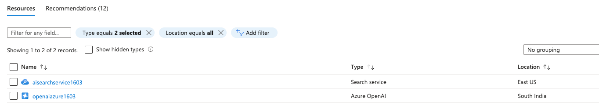
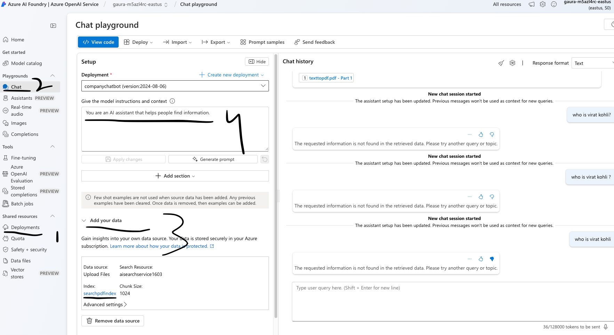
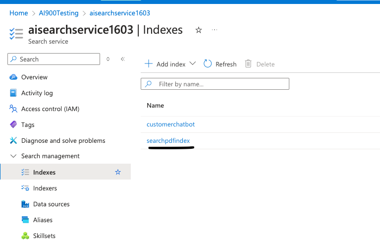

**This small project deals with creating an AI chatbot using the Azure OpenAI capability.**

**Tech stack:**
* Azure OpenAI
* Azure Search
* Python/flask
* HTML

Resource to be spin off on azure:

Refer the image:

1) You need to deploy the model first using deployment tab
2) Go to chat playground to open the chat interface 
3) You need to load the pdf, text file, csv - anything that suits the business.
Under the hood, it uses Azure AI search to chunk and index the data.

5) Give the context to the bot and start the conversation with the bot

Python SDK usage:
1) Use the endpoint/OpenAI key of the OpenAI and endpoint/Search Key of the search service in code in openAIChat.py.
2) Use flask and HTML to give user an interface to ask question about the pdf/document loaded on OpenAI playground.

Note: Once the project is done, delete all the resources.